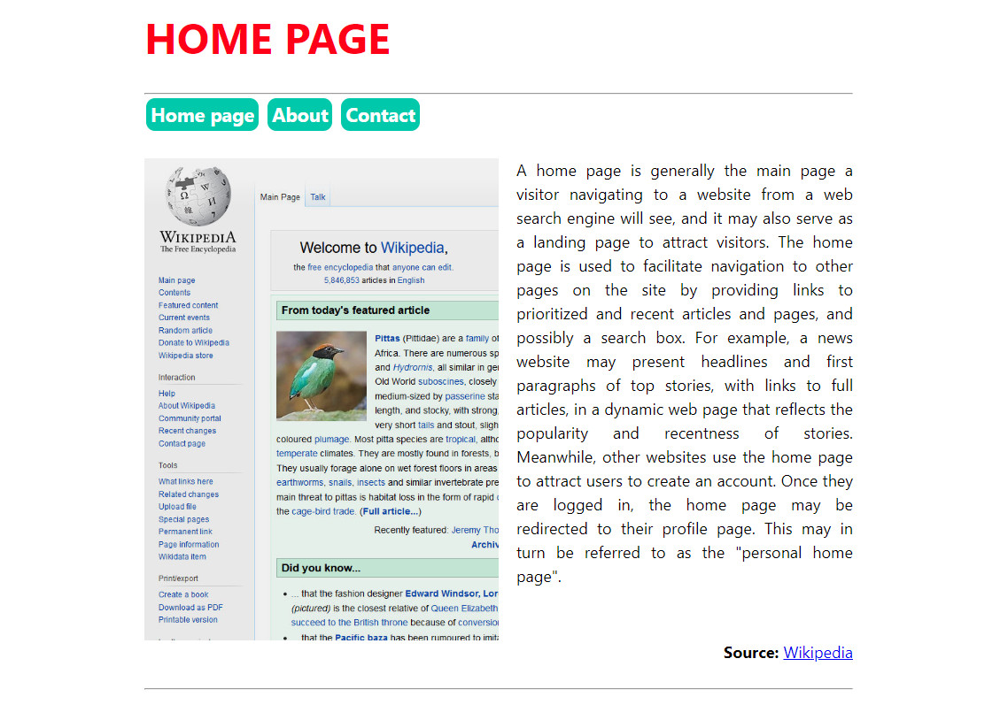
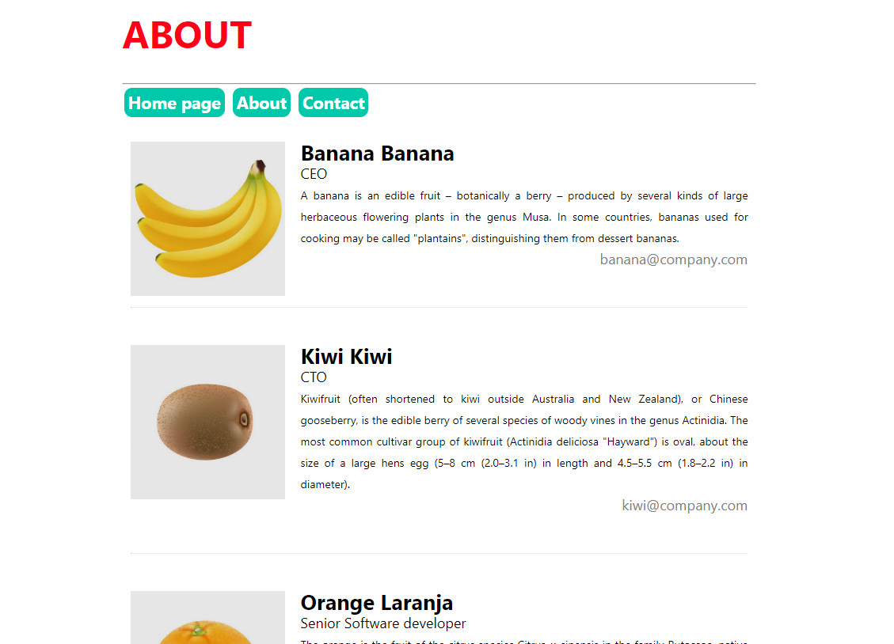
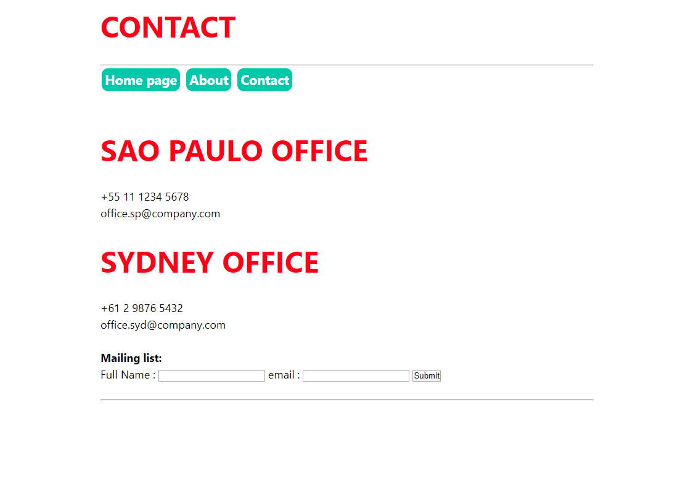

# Basic App - Django

This is a simple project that demonstrates an example of project structure for a Django app, using *templates*, *static* files, *database*, *requests* and so.

```bash
$ python manage.py runserver
```

## Project structure
Home page (**Template**, **static** ..)



About (**Template**, **static**, **database** ..)



Contact (**Template**, **static**, **database**, **requests** ..)

